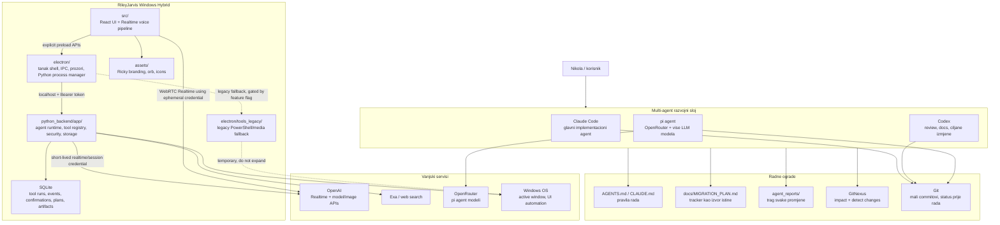
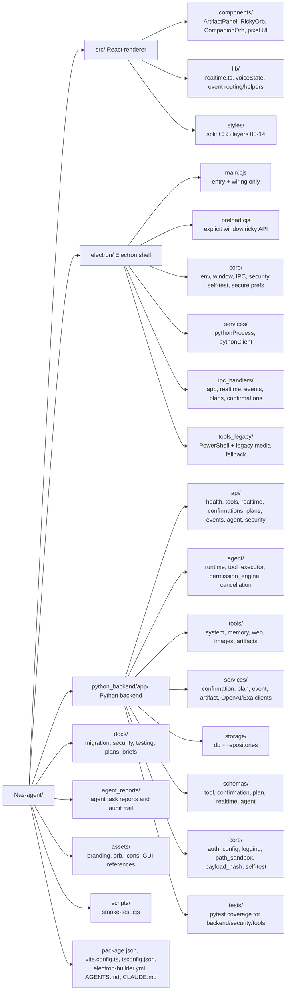
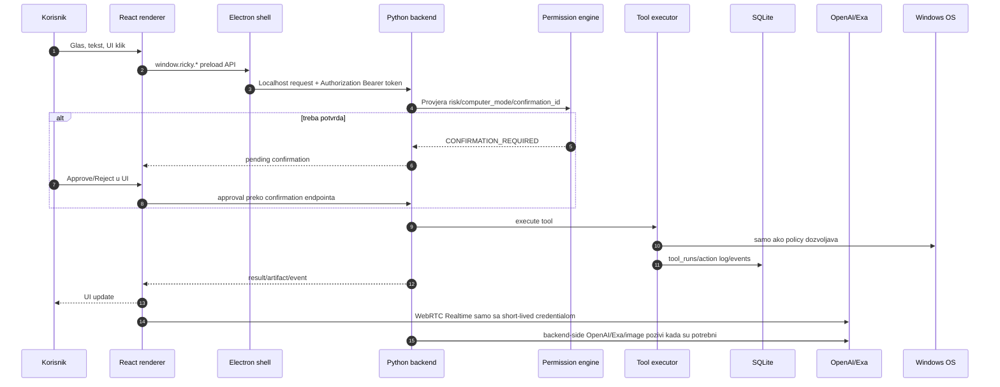
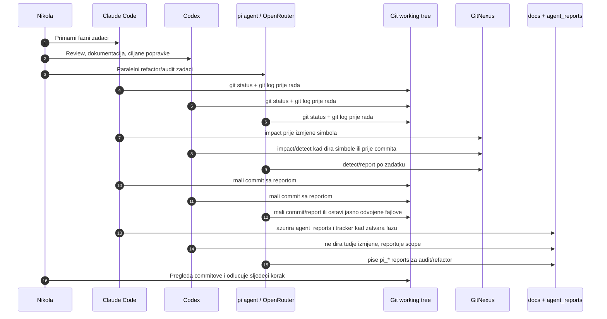
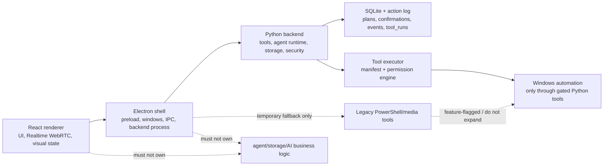

# Multi-agent security architecture map

**Datum:** 2026-07-10  
**Projekat:** RileyJarvis Windows Hybrid ("Nas-agent")  
**Svrha:** jedan vizuelni dokument koji spaja hijerarhiju fajlova,
sigurnosne mjere i multi-agentski radni tok.

> Izvor istine za faze je `docs/MIGRATION_PLAN.md`. Ovaj dokument je mapa za
> orijentaciju; ne zamjenjuje tracker, `SECURITY_HARDENING_PLAN.md`,
> `SECURITY_MODEL.md` ili `TOOL_CONTRACTS.md`.

---

## 1. Velika slika

**Glavno pravilo:** React/Electron je UI shell; Python backend je vlasnik
agent runtime-a, toolova, storage-a, automation-a i AI integracija. Nova
business/agent/storage/AI logika ne ide u `electron/main.cjs`.

---

## 2. Hijerarhija fajlova

### Prakticna navigacija

| Dio | Glavni fajlovi/folderi | Uloga |
| --- | --- | --- |
| UI shell | `src/App.tsx`, `src/components/**`, `src/styles/**` | Vizuelni dio, voice UI, artifact panel, confirmations, companion/mini orb. |
| Realtime voice | `src/lib/realtime.ts`, `src/lib/realtimeEventRouter.ts`, `src/lib/voiceState.ts` | WebRTC/OpenAI Realtime pipeline ostaje u rendereru; Python ne preuzima mikrofon/VAD/STT/TTS u MVP-u. |
| Electron shell | `electron/main.cjs`, `electron/core/**`, `electron/ipc_handlers/**` | Prozori, IPC wiring, secure web preferences, Python process manager. |
| Backend client/process | `electron/services/pythonProcess.cjs`, `electron/services/pythonClient.cjs` | Pokretanje backend-a, local token, Bearer auth prema backend-u. |
| Python API | `python_backend/app/api/**` | REST endpointi za health, tools, realtime session, events, confirmations, plans, agent. |
| Agent/tool runtime | `python_backend/app/agent/**` | Tool registry, executor, permission engine, cancellation, model client, runtime. |
| Storage | `python_backend/app/storage/**` | SQLite schema i repository sloj. |
| Security core | `python_backend/app/core/**`, `electron/core/securitySelfTest.cjs`, `electron/core/secureWebPreferences.cjs` | Auth, redaction, path sandbox, security self-test, Electron hardening. |
| Legacy | `electron/tools_legacy/**`, `electron/core/legacyTools.cjs` | Privremeni fallback; ne siriti i ne brisati dok Python zamjena nije testirana. |
| Operativni trag | `agent_reports/**`, `docs/MIGRATION_PLAN.md` | Sta je uradjeno, zasto, testovi, rizici, status faza. |

---

## 3. Runtime tok aplikacije

---

## 4. Implementirane sigurnosne mjere

```mermaid
flowchart TB
  subgraph ElectronSec["Electron / renderer zastita"]
    WebPrefs["secureWebPreferences<br/>nodeIntegration=false<br/>contextIsolation=true<br/>sandbox=true<br/>webSecurity=true"]
    IPC["IPC allowlist<br/>bez generic ipcRenderer.invoke"]
    CSP["Production CSP<br/>meta CSP u buildu + self-test gate"]
    Preload["preload.cjs<br/>samo eksplicitni window.ricky API"]
    XSS["Renderer XSS audit<br/>dangerouslySetInnerHTML samo Mermaid strict SVG"]
  end

  subgraph BackendSec["Backend zastita"]
    Localhost["127.0.0.1 lokalni backend"]
    Token["RICKY_LOCAL_TOKEN<br/>Authorization: Bearer token"]
    SelfTest["/security/self-test<br/>Electron + backend gate"]
    Redaction["SecretRedactionFilter<br/>bez API/token logovanja"]
    PathSandbox["path_sandbox primitivi<br/>spremno za file tools"]
  end

  subgraph ToolSec["Tool / agent zastita"]
    Manifest["ToolDefinition manifest<br/>risk, confirmation, computer_mode"]
    Permission["permission_engine.py<br/>risk + confirmation_id + payload_hash + expiry"]
    Cancellation["cancellation.py<br/>execution_id + cancel-all / per-id cancel"]
    ComputerMode["Computer Mode<br/>OFF na startu, high-risk gate"]
    ActiveWindow["Active window validation<br/>blocked apps za computer_* write akcije"]
    PromptInjection["External content escalation<br/>read->act trazi potvrdu"]
  end

  subgraph WorkflowSec["Razvojne ograde"]
    NoShell["Nema model-facing arbitrary shell toola"]
    NoMainLogic["Nema nove business logike u electron/main.cjs"]
    Reports["agent_reports za svaku fazu/zadatak"]
    GitNexus["GitNexus impact prije simbola<br/>detect prije commita"]
    Tracker["MIGRATION_PLAN tracker<br/>jedini status faza"]
    Quality["npm run quality<br/>typecheck, check, build, pytest, smoke"]
  end

  ElectronSec --> BackendSec
  BackendSec --> ToolSec
  ToolSec --> WorkflowSec
```

### Security kontrolna lista

| Kontrola | Gdje je vidljiva | Status u ovom projektu |
| --- | --- | --- |
| Electron hardening | `electron/core/secureWebPreferences.cjs`, `electron/core/window.cjs` | Implementirano za renderer prozore; self-test provjerava produkcijske postavke. |
| IPC allowlist | `electron/core/ipc.cjs`, `electron/ipc_handlers/**`, `electron/preload.cjs` | Eksplicitni kanali i preload API, bez generic IPC prolaza. |
| Backend local auth token | `python_backend/app/core/auth.py`, `electron/services/pythonProcess.cjs`, `electron/services/pythonClient.cjs` | Electron generise per-session token i backend zahtijeva Bearer token u Electron-pokrenutom toku. |
| Realtime key isolation | `python_backend/app/api/realtime.py`, `src/lib/realtime.ts` | Standardni API key ostaje backend-side; renderer dobija kratkozivuci Realtime credential. |
| Tool manifest | `python_backend/app/schemas/tool.py`, `python_backend/app/agent/tool_registry.py` | Toolovi nose risk/confirmation/computer_mode metadata. |
| Permission engine | `python_backend/app/agent/permission_engine.py` | High/critical akcije prolaze kroz risk, computer mode i confirmation provjere. |
| Confirmation binding | `python_backend/app/core/payload_hash.py`, confirmation service/repo | `confirmation_id` je vezan za tool name, payload hash i expiry; ne moze se lako replay/swap. |
| Cancellation | `python_backend/app/agent/cancellation.py`, `POST /tools/executions/cancel-all` | Stop/kill-switch moze traziti backend cancellation, ne samo prekinuti glas. |
| Computer Mode safety | `electron/main.cjs`, `python_backend/app/agent/permission_engine.py`, UI components | Mode je eksplicitan, OFF na startu, high-risk toolovi ga zahtijevaju. |
| Active window / blocked apps | `python_backend/app/agent/permission_engine.py`, `python_backend/app/tools/system/computer.py` | Python computer-use write toolovi imaju blocked-app zastitu. |
| Log redaction | `python_backend/app/core/logging.py` | API kljucevi/tokeni se rediguju u backend logovima. |
| Path sandbox primitive | `python_backend/app/core/path_sandbox.py` | Primitivi postoje; obavezno koristiti kad se dodaju file/path toolovi. |
| CSP | `vite.config.ts`, `electron/core/securitySelfTest.cjs` | Produkcijski build dobija CSP meta; self-test gate provjerava. |
| XSS audit | `agent_reports/2026-07-09_pi-xss-sink-audit.md`, `src/components/ArtifactPanel.tsx` | Jedini HTML sink je Mermaid SVG pod `securityLevel: "strict"`; ostalo React escape. |
| Fail-closed / kill switch | `electron/main.cjs`, `src/App.tsx`, related reports | Global/visible Stop gasi voice/mic, forsira Computer Mode OFF i zove cancel-all. |
| Quality gate | `package.json`, `docs/TESTING.md`, `python_backend/tests/**` | `npm run quality` spaja typecheck, syntax check, build, pytest i smoke. |

---

## 5. Multi-agentski radni tok

### Pravila saradnje u istom filesystemu

1. `git status` i `git log` prije rada.
2. Ne stageovati tudje nekomitovane izmjene.
3. Recurring collision fajlove (`python_backend/app/core/config.py`,
   `app/main.py`, `electron/main.cjs`) citati svjeze neposredno prije izmjene.
4. Jedna faza ili jedan mali zadatak = jedan mali skup promjena.
5. `agent_reports/` objasnjava sta je dirano, zasto, kako je provjereno i sta
   nije dirano.
6. `docs/MIGRATION_PLAN.md` tracker se azurira u istom commitu samo kad se
   stvarno zatvara faza/acceptance kriterij.
7. Ako GitNexus kaze HIGH/CRITICAL impact, agent staje i prijavljuje rizik.

---

## 6. Granice odgovornosti

**Najvaznija granica:** model output nikad nije sigurnosna granica. Tool
executor i permission engine su sigurnosna granica.

---

## 7. Kako koristiti ovu mapu

- Kada novi agent ulazi u projekat: prvo procita ovaj dokument, `AGENTS.md`,
  `CLAUDE.md` i `docs/MIGRATION_PLAN.md`.
- Kada se dira UI: gledati `src/**`, ali ne mijesati runtime/tool logiku u UI.
- Kada se dira OS/tool ponasanje: gledati `python_backend/app/agent/**`,
  `python_backend/app/tools/**`, `TOOL_CONTRACTS.md` i security dokumente.
- Kada se dira Electron: provjeriti da promjena ostaje shell/IPC/process-manager
  sloj, bez nove business logike u `electron/main.cjs`.
- Kada se radi commit: pokrenuti relevantne provjere, `gitnexus_detect_changes`
  i napisati `agent_reports/` izvjestaj.

---

## 8. Poznate napomene

- `docs/ARCHITECTURE.md` je referenciran u nekim dokumentima, ali trenutno nije
  prisutan u tree-u. Za status faza koristiti `docs/MIGRATION_PLAN.md`.
- `python_backend/app/core/path_sandbox.py` postoji kao security primitive; ne
  smije ostati "ukras" kada se dodaju toolovi koji primaju putanje.
- Legacy PowerShell/media put je privremen. Ne siriti ga i ne brisati ga dok
  Python zamjena nije testirana.
- `agent_reports/` nije samo arhiva; to je radni trag za vise agenata koji
  dijele isti filesystem.
